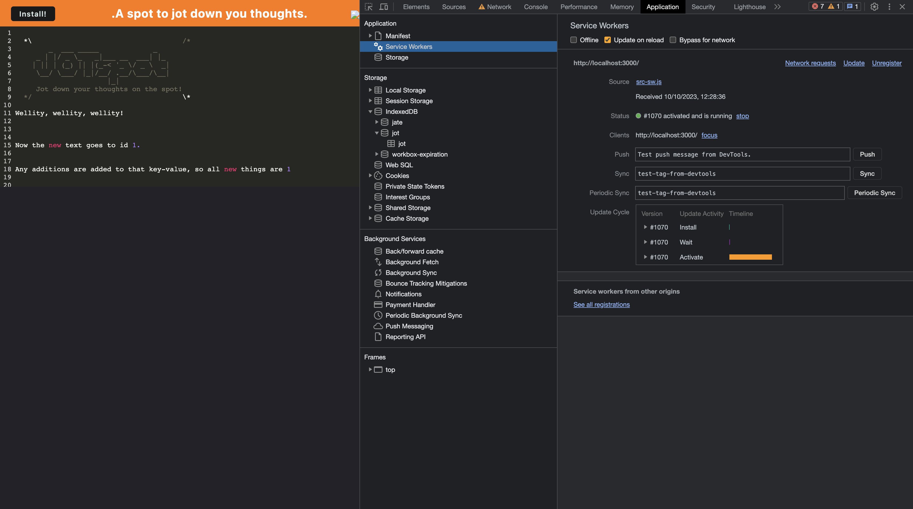

# JOTspot: Jot down your thoughts on the spot

## Description

The purpose of this project is to transform a simple note-taking web-app into a Progressive Web App (PWA) in order for it to cache written notes, be available offline, and be installable to a user's desktop. The User Story and Acceptance Criteria are as follows:

## User Story

```md
AS A developer
I WANT to create notes or code snippets with or without an internet connection
SO THAT I can reliably retrieve them for later use
```

## Acceptance Criteria

```md
GIVEN a text editor web application
WHEN I open my application in my editor
THEN I should see a client server folder structure
WHEN I run `npm run start` from the root directory
THEN I find that my application should start up the backend and serve the client
WHEN I run the text editor application from my terminal
THEN I find that my JavaScript files have been bundled using webpack
WHEN I run my webpack plugins
THEN I find that I have a generated HTML file, service worker, and a manifest file
WHEN I use next-gen JavaScript in my application
THEN I find that the text editor still functions in the browser without errors
WHEN I open the text editor
THEN I find that IndexedDB has immediately created a database storage
WHEN I enter content and subsequently click off of the DOM window
THEN I find that the content in the text editor has been saved with IndexedDB
WHEN I reopen the text editor after closing it
THEN I find that the content in the text editor has been retrieved from our IndexedDB
WHEN I click on the Install button
THEN I download my web application as an icon on my desktop
WHEN I load my web application
THEN I should have a registered service worker using workbox
WHEN I register a service worker
THEN I should have my static assets pre cached upon loading along with subsequent pages and static assets
WHEN I deploy to Heroku
THEN I should have proper build scripts for a webpack application
```

Images of the deployed app can be found below:

The following animation demonstrates the application functionality:


The following image shows the application's `manifest.json` file:


The following image shows the application's registered service worker:



The following image shows the application's IndexedDB storage:


## Table of Contents

- [Installation](#installation)
- [Usage](#usage)
- [Contribute](#contribute)
- [Credits](#credits)
- [License](#license)
- [Questions](#questions)

## Installation

In order to install the project, the user must navigate to the deployed app on heroku at <> and click on the install button, whereupon they will be asked to confirm the installation and BOOM, app installed.

## Usage

This app is a simple note-taking app, and the user need only jot down whatever comes to mind for the contents to be cached on their computer  or browser. Please note that if the user is signed in to the browser, the notes will be accessible to that user only on Chrome, other users will start with a blank note pad.

## Contribute

Anyone can contribute to the project by forking or cloning the repo, it is not likely that the project will be continued as it is, but people are free to use it and modify it as they wish.

## Credits

## License

### MIT License

[](https://opensource.org/licenses/MIT)

A short and simple permissive license with conditions only requiring preservation of copyright and license notices. Licensed works, modifications, and larger works may be distributed under different terms and without source code

<https://opensource.org/licenses/MIT>

## Questions

You can reach me through my GitHub or by email
if you have and questions or comments.

GitHub: <https://www.github.com/Benhwaet>

email: <benhwaet@gmail.com>
